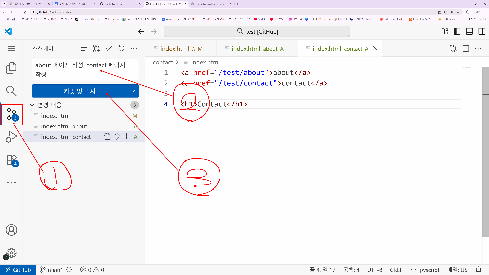

# study02 - 251109 깃헙공부

## Github이란?
- **시간 여행이 가능한 구글드라이브**! 혹은 시간 여행이 가능한 공유 폴더라고 생각하면 됩니다!

## Github의 특징
- 시간 여행이 가능한데, 여기서 어떤 시간대로 돌아갈 것인가에 대한 선택지 => 바로 **버전**입니다.
- 협업할 때 , 버전이 만들어질 때마다 누가 무엇을 얼만큼 생성, 수정, 삭제 했는지를 확인할 수 있습니다.
- 레파지토리를 기반으로 동작 (폴더라고 생각하면 된다) 합니다.

## 레파지토리 생성하기

1. 깃헙페이지에서 회원가입/로그인을 한 후 `+` 버튼을 누릅니다.
2. `New repository`를 누릅니다.
3. Repository name을 중복되지 않게 작성해 줍니다.
4. Public 과 Private 중 `Public`을 선택 합니다. : 누구나 볼 수 있게 하기 위함입니다.
5. README file 생성 버튼을 체크해 줍니다. : 그렇지 않으면 명령어를 많이 입력해야 합니다. 레파지토리를 설명해주는 파일입니다.
6. `Create repository`버튼을 눌러서 생성해줍니다.

## 파일 변경해 보기

1. 변경하고자 하는 레파지토리 페이지에서 주소검색창 속의 주소를 수정합니다.
- `github.com` -> `github.dev`  

2. 웹페이지 내에서 에디팅이 가능한 깃헙 에디터로 이동하게 됩니다.
- 커밋 & 푸시가 가능합니다.
3. 이미지의 순서대로 진행하며, 커밋은 버전을 만드는 것이고, 푸쉬는 반영을 하는 것입니다.
- 커밋 메시지를 작성할 때에는 시간여행이 수월하도록 상세하게 작성합니다.

